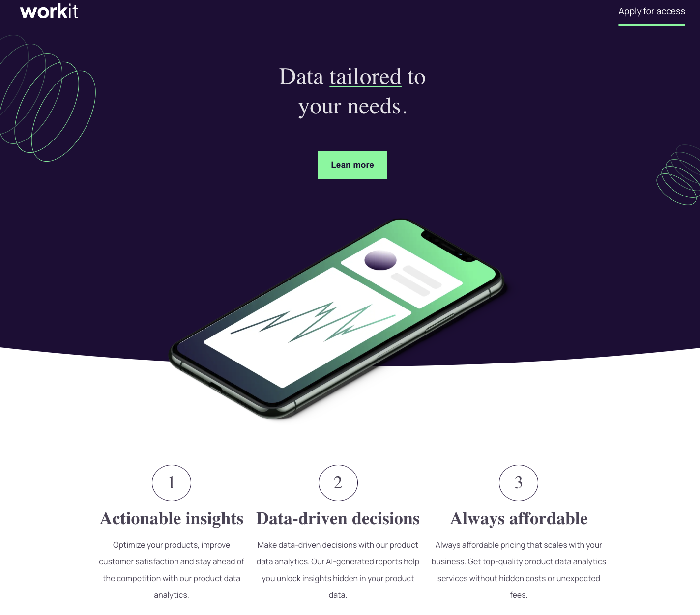

## Overview

Hello and thanks for visiting this project! 🎉

The mission behind this project was to build a beautifully designed and fully responsive landing page, emphasizing both aesthetics and usability.

The development process focused on modern front-end technologies to ensure a high-quality user experience. Feel free to view the live version of the project [here](https://workit-oniasfilho.netlify.app/).



## Technologies Used

- **React.js (Vite)**: A fast and optimized development setup for crafting high-performance UI components.

- **TypeScript**: Added static typing to JavaScript, making development more predictable and reducing potential runtime errors.

- **CSS3**: Utilized for layout and styling, ensuring a clean and maintainable codebase.

- **CSS Variables**: Implemented design tokens for consistent styling and easier theme management.

- **Mobile-First Approach**: Designed and developed with a mobile-first mindset, ensuring an excellent experience on mobile, tablet, and desktop devices.

- **Key CSS Techniques applied in this project**:
  - **Custom Clipping and Background Effects**: The `upper-section::before` uses a `clip-path` with an elliptical shape to create a dynamic background transition.
  - **Custom Hover Effects**: The `.green-underline` class utilizes `text-underline-offset`, `transform`, and `transition` properties to create a smooth interactive experience.
  - **CSS Aspect Ratio Management**: The `.founder-image` uses `aspect-ratio: 16 / 9;` to maintain a responsive image ratio.
  - **Z-Index Stacking and Positioning**: The `.cta-content` and `.cta-content::before` elements use absolute positioning with `z-index` to layer elements effectively for a unique visual effect.
  - **Adaptive Layout with `min-width` Variables**: The project applies `--min-width` in the `:root` for a more flexible and scalable responsive design.

## Features Implemented

### Landing Page Design

- Elegant and modern UI, designed to be visually appealing and engaging.

### Fully Responsive Layout

- The page adapts seamlessly to different screen sizes, ensuring a consistent experience across devices.

### Interactive Elements

- Buttons and interactive components include hover and focus states to enhance the user experience.

### Accessibility Considerations

- Built with accessibility best practices in mind to ensure usability for all users.

## Setup & Installation

1. Clone the repository:

   ```bash
   git clone https://github.com/oniasfilho/workit-ui
   ```

2. Change into the project directory:

   ```bash
   cd workit-ui
   ```

3. Install the required dependencies:

   ```bash
   npm install
   ```

4. Fire up the application:

   ```bash
   npm run dev
   ```

## Support

Should you have any questions or need assistance, don't hesitate to connect with me on LinkedIn: [Onias Filho](https://www.linkedin.com/in/oniasfilho). I'm always happy to help and discuss front-end development challenges.

Huge thanks for checking out this project! Feel free to explore the codebase and see how it was built.
